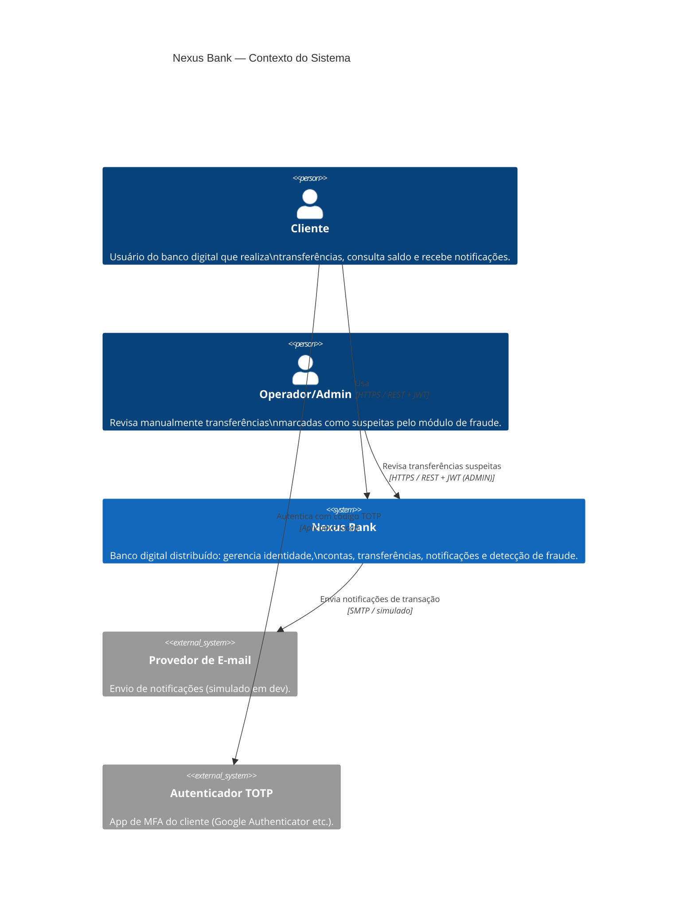
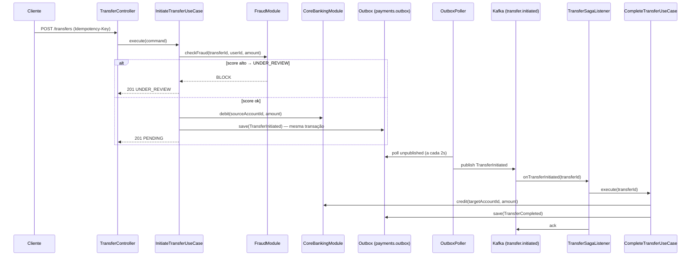

# Diagramas C4 — Nexus Bank

> Gerados em Mermaid. Renderizáveis no GitHub, Obsidian e qualquer editor com suporte a Mermaid.

---

## Nível 1 — Contexto do Sistema

Mostra o Nexus Bank e seus atores/sistemas externos.



---

## Nível 2 — Diagrama de Containers

Mostra os deployables e serviços de infraestrutura.

```mermaid
C4Container
    title Nexus Bank — Containers

    Person(cliente, "Cliente")
    Person(operador, "Operador/Admin")

    Container_Boundary(frontend_boundary, "Frontend") {
        Container(nginx, "Nginx (SPA + Proxy)", "Nginx 1.27 / React 18 + Vite",
            "Serve a SPA e faz proxy reverso das chamadas à API para os serviços backend.")
    }

    Container_Boundary(core_boundary, "nexus-bank-core") {
        Container(core, "Nexus Bank Core", "Java 21 / Spring Boot 3 / Spring Modulith",
            "Monólito modular com os bounded contexts: Identity, Core Banking, Payments e Fraud.\nExpõe REST API na porta 8080.")
    }

    Container_Boundary(notif_boundary, "notifications-service") {
        Container(notifications, "Notifications Service", "Java 21 / Spring Boot 3",
            "Microsserviço extraído. Consome eventos Kafka e simula envio de e-mail/push.\nExpõe REST API de consulta na porta 8081.")
    }

    Container_Boundary(infra_boundary, "Infraestrutura") {
        ContainerDb(postgres,    "PostgreSQL 16",   "RDBMS",          "Esquemas isolados por módulo:\nidentity, corebanking, payments, notifications, fraud.")
        Container(kafka,         "Apache Kafka",     "Mensageria",     "Tópicos: transfer.initiated, transfer.completed,\ntransfer.failed, corebanking.account.opened.")
        ContainerDb(redis,       "Redis 7",          "Cache / Store",  "Cache de saldo, refresh tokens e blacklist de JWT.")
    }

    Container_Boundary(obs_boundary, "Observabilidade") {
        Container(prometheus,    "Prometheus",       "Métricas",       "Coleta métricas do actuator/prometheus.")
        Container(grafana,       "Grafana",          "Dashboards",     "Métricas (Prometheus), Logs (Loki), Traces (Tempo).")
        Container(loki,          "Loki",             "Logs",           "Agrega logs estruturados dos serviços.")
        Container(tempo,         "Tempo",            "Tracing",        "Recebe spans OTLP; correlaciona traces distribuídos.")
    }

    Rel(cliente,       nginx,         "Navega e faz chamadas API", "HTTPS :80")
    Rel(operador,      nginx,         "Revisa transferências",     "HTTPS :80")
    Rel(nginx,         core,          "Proxy /auth /accounts /transfers /fraud", "HTTP :8080")
    Rel(nginx,         notifications, "Proxy /notifications",      "HTTP :8081")

    Rel(core,          postgres,      "Lê/Escreve",  "JDBC / Flyway")
    Rel(notifications, postgres,      "Lê/Escreve",  "JDBC / Flyway")
    Rel(core,          redis,         "Cache + tokens", "Lettuce / Redis Protocol")
    Rel(core,          kafka,         "Publica eventos via Outbox", "Kafka Producer")
    Rel(notifications, kafka,         "Consome eventos",            "Kafka Consumer")
    Rel(core,          kafka,         "Consome TransferInitiated (Saga)", "Kafka Consumer")

    Rel(core,          prometheus,    "Expõe /actuator/prometheus", "HTTP scrape")
    Rel(notifications, prometheus,    "Expõe /actuator/prometheus", "HTTP scrape")
    Rel(core,          loki,          "Envia logs estruturados",    "HTTP / Logback-Loki")
    Rel(core,          tempo,         "Envia spans OTLP",           "OTLP/HTTP :4318")
```

---

## Nível 3 — Componentes do nexus-bank-core

Mostra os módulos internos e como eles se comunicam.

```mermaid
C4Component
    title nexus-bank-core — Componentes (Módulos Spring Modulith)

    Container_Boundary(core, "nexus-bank-core") {

        Component(identity,     "Módulo Identity",     "Spring Modulith Module",
            "Registro, login, JWT stateless, refresh rotativo,\nMFA TOTP, BCrypt. Guarda Users em identity.users.")

        Component(corebanking,  "Módulo Core Banking", "Spring Modulith Module",
            "Abertura de conta, saldo, extrato (CQRS read model).\nCache de saldo no Redis. Evento AccountOpened → Kafka via Outbox.")

        Component(payments,     "Módulo Payments",     "Spring Modulith Module",
            "Saga de transferência com Transactional Outbox.\nIdempotência (Idempotency-Key), concorrência (locking otimista),\nresiliência (circuit breaker, retry, bulkhead, rate limiter).\nPIX, TED, interna e agendamento.")

        Component(fraud,        "Módulo Fraud",        "Spring Modulith Module",
            "Score de risco por regras (valor, frequência, destino novo).\nTransferências de alto risco entram em UNDER_REVIEW.\nAuditoria persistida em fraud.evaluations.")

        Component(infra,        "Infrastructure",      "Spring Beans transversais",
            "SecurityConfig, FlywayConfig, KafkaConfig,\nOpenApiConfig, OutboxPoller, SchedulingConfig.")
    }

    ContainerDb(postgres, "PostgreSQL", "RDBMS", "Esquemas: identity, corebanking, payments, fraud")
    Container(kafka,      "Kafka",      "Mensageria")
    ContainerDb(redis,    "Redis",      "Cache")

    Rel(payments,     corebanking,  "Débito/Crédito + isOwner", "API pública do módulo")
    Rel(payments,     fraud,        "FraudCheckRequest",        "API pública do módulo (síncrona)")
    Rel(corebanking,  identity,     "Sem dependência direta",   "—")

    Rel(infra,        kafka,        "OutboxPoller publica eventos", "Kafka Producer")
    Rel(infra,        payments,     "TransferSagaListener consome TransferInitiated", "Kafka Consumer")

    Rel(identity,     postgres,     "identity.users",              "JPA")
    Rel(corebanking,  postgres,     "corebanking.*",               "JPA")
    Rel(payments,     postgres,     "payments.*",                  "JPA")
    Rel(fraud,        postgres,     "fraud.*",                     "JPA")
    Rel(corebanking,  redis,        "Cache de saldo",              "Spring Cache")
    Rel(identity,     redis,        "Refresh tokens + blacklist",  "RedisTemplate")
```

---

## Fluxo da Saga de Transferência

Detalhe da coreografia Saga + Outbox dentro do nexus-bank-core.


